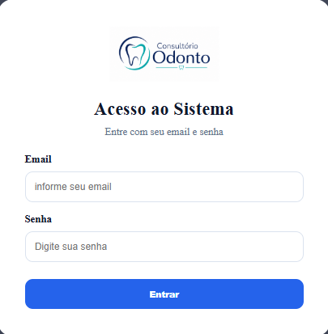
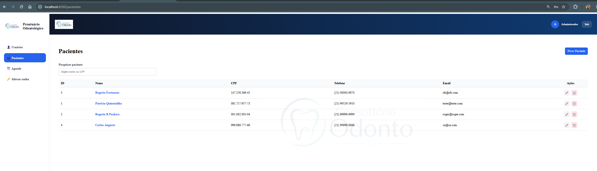
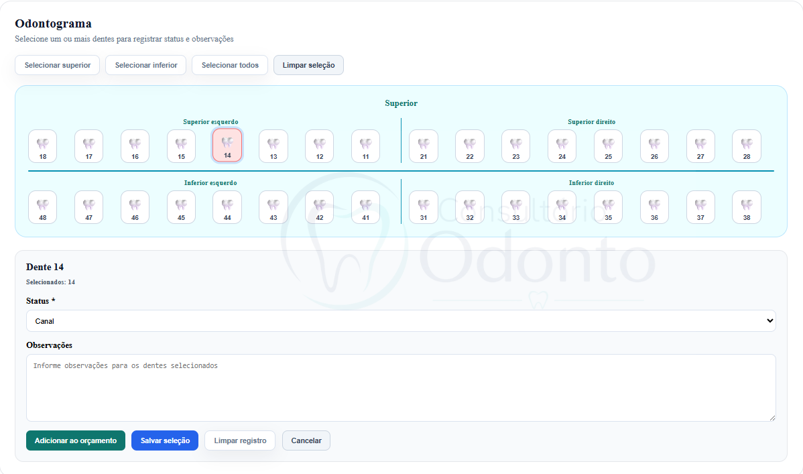
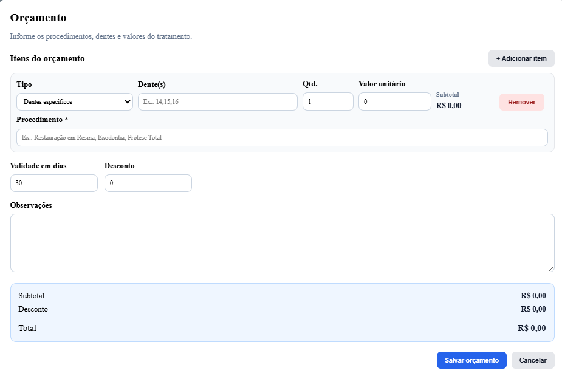
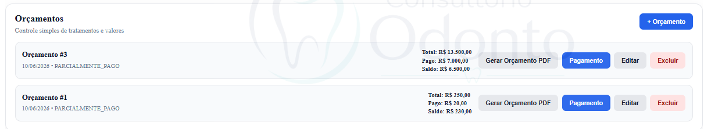
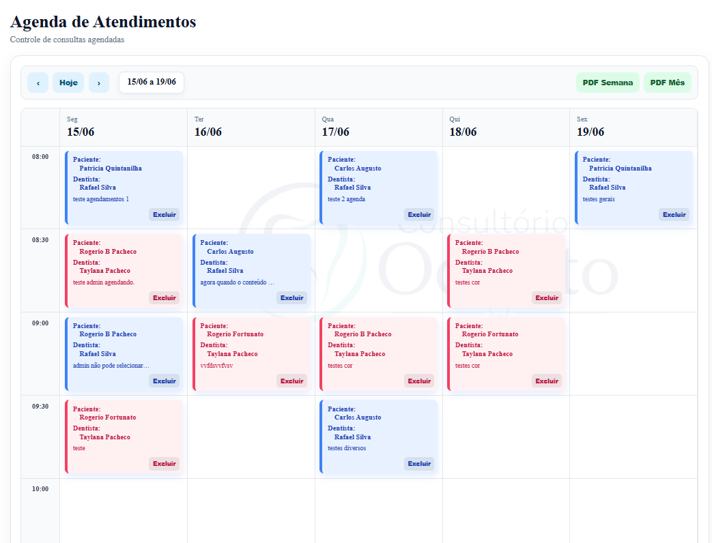
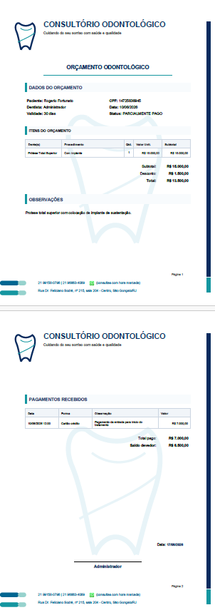
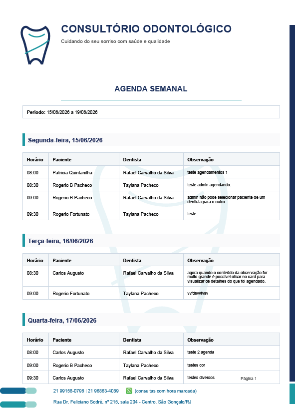

# 🦷 Prontuário Odontológico

Sistema completo para gestão de consultórios odontológicos, desenvolvido com **Spring Boot**, **Angular** e **PostgreSQL**, com implantação simplificada via **Docker Compose**.

Projetado para operação local em clínicas e consultórios, oferecendo controle integrado de pacientes, prontuários, odontogramas, orçamentos, pagamentos e agenda compartilhada.

---

## 📸 Visão Geral do Sistema

### Tela de Login



Controle seguro de acesso através de usuários e perfis.

---

### Gestão de Pacientes



- Cadastro completo de pacientes
- Pesquisa rápida
- Histórico clínico
- Controle centralizado dos dados

---

### Odontograma



- Seleção individual de dentes
- Seleção múltipla
- Controle de próteses
- Integração com orçamento

---

### Orçamentos




- Múltiplos procedimentos
- Controle financeiro integrado
- Pagamentos registrados
- Saldo devedor automático
- Status do tratamento

---

### Agenda Compartilhada



- Agenda semanal visual
- Controle de horários
- Reagendamento por arrastar e soltar
- Identificação por dentista
- Controle de conflitos

---

### PDF de Orçamento



Geração profissional de orçamento para entrega ao paciente.

---

### PDF da Agenda



Exportação semanal e mensal para consulta externa e compartilhamento.

---

# 🚀 Principais Funcionalidades

## 👥 Gestão de Pacientes

- Cadastro de pacientes
- Edição de pacientes
- Pesquisa de pacientes
- Exclusão lógica
- Histórico completo de atendimento

---

## 🩺 Anamnese

Registro clínico contendo:

- Hipertensão
- Diabetes
- Alergias
- Medicamentos
- Tabagismo
- Gravidez
- Observações

---

## 📎 Gerenciamento de Anexos

Upload e download de:

- Radiografias
- Fotografias
- Exames
- Receitas
- Atestados
- Documentos diversos

---

## 🦷 Odontograma

Recursos:

- Seleção individual
- Seleção múltipla
- Prótese total superior
- Prótese total inferior
- Prótese total completa

---

## 💰 Orçamentos

- Múltiplos itens por orçamento
- Integração com odontograma
- Descontos
- Validade
- Numeração automática por paciente

---

## 💳 Pagamentos

Controle automático de:

- Total do orçamento
- Total pago
- Saldo devedor

Status:

- ABERTO
- PARCIAL
- QUITADO

---

## 📅 Agenda Compartilhada

### Recursos

- Agenda semanal
- Horários de 30 em 30 minutos
- Atendimento das 08h às 21h
- Controle de conflitos
- Reagendamento visual (Drag & Drop)

### Regras de Negócio

- Paciente vinculado ao dentista responsável
- Não permite agendar paciente para outro dentista
- Nem mesmo usuários administradores podem ignorar essa regra

---

## 📄 Geração de PDFs

### Orçamento

Contendo:

- Dados do paciente
- Procedimentos
- Valores
- Pagamentos
- Saldo devedor

### Agenda

- Agenda semanal
- Agenda mensal
- Organização por dia
- Paciente
- Dentista
- Observações

---

# 🔐 Controle de Usuários

## Administrador

- Cadastro de usuários
- Gestão completa do sistema
- Visualização global

## Dentista

- Controle dos próprios pacientes
- Agenda
- Tratamentos
- Orçamentos

---

# 🛠️ Tecnologias Utilizadas

### Backend

- Java 21
- Spring Boot
- Spring Data JPA
- Hibernate
- Flyway

### Frontend

- Angular
- TypeScript
- SCSS

### Banco de Dados

- PostgreSQL

### Infraestrutura

- Docker
- Docker Compose

---

# 🚀 Instalação

## Pré-requisitos

- Docker Desktop
- Docker Compose

## Executar

```bash
docker compose up --build -d
```

## Acesso

Frontend:

```text
http://localhost:4200
```

Backend:

```text
http://localhost:8080
```

---

# 💾 Backup e Migração

O sistema foi desenvolvido para permitir:

- Backup simplificado
- Migração entre computadores
- Preservação dos dados dos pacientes
- Atualizações via Flyway sem perda de informações

---

# 📈 Próximas Evoluções

- Dashboard inicial
- Indicadores financeiros
- Relatórios gerenciais
- Confirmação de consultas
- Integração com WhatsApp
- Relatórios de faturamento

---

# 👨‍💻 Autor

**Rafael Carvalho da Silva**

Desenvolvedor de Software com ampla experiência no desenvolvimento de aplicações corporativas, sistemas web e soluções voltadas à automação de processos de negócio.

Possui atuação em todo o ciclo de desenvolvimento de software, desde o levantamento de requisitos e modelagem de dados até a implementação, testes, implantação e sustentação de sistemas em produção.

Neste projeto, foi responsável pela arquitetura e desenvolvimento completo da solução, utilizando tecnologias modernas para backend, frontend, banco de dados e infraestrutura, incluindo Java, Spring Boot, Angular, TypeScript, PostgreSQL, Docker, Docker Compose, Hibernate, JPA, Flyway, HTML, SCSS e Git.

Possui experiência na construção de APIs REST, modelagem de banco de dados relacional, desenvolvimento de interfaces web responsivas, integração entre sistemas, controle de versionamento, containers e boas práticas de engenharia de software.

Tem como foco o desenvolvimento de soluções robustas, escaláveis e de fácil manutenção, sempre priorizando qualidade de código, experiência do usuário e eficiência operacional.


---

### Contato

📧 **E-mail:** avliscleafar@gmail.com

💼 **LinkedIn:**  
[](https://www.linkedin.com/in/rafael-silva-9688ab128)
